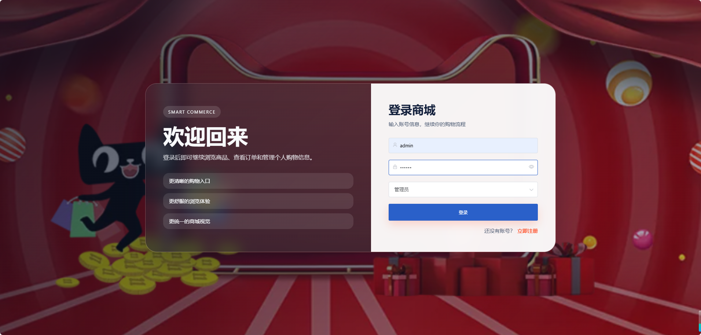
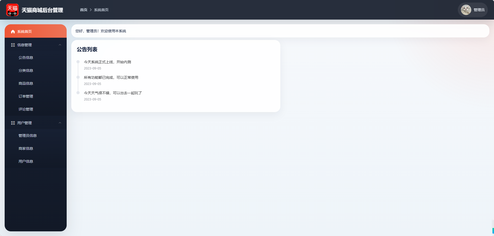
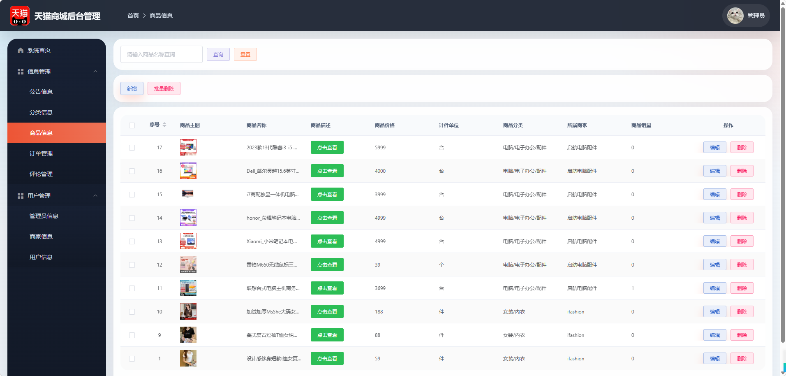
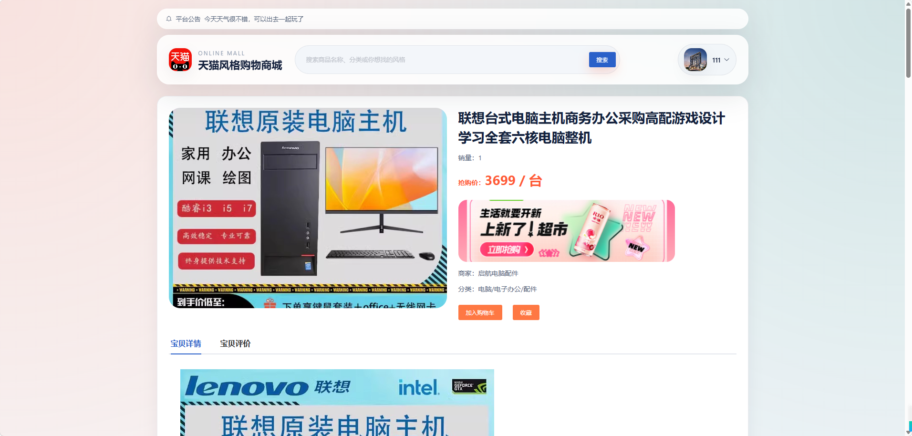
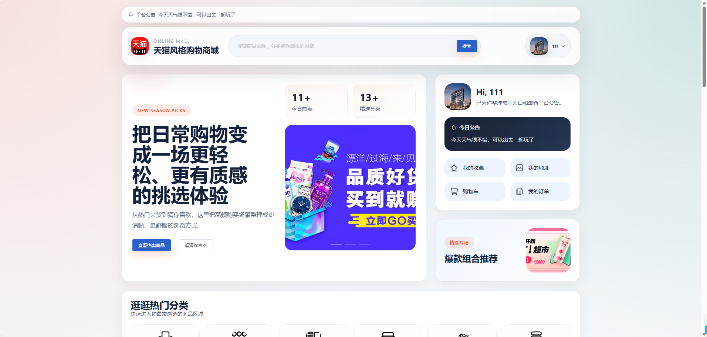
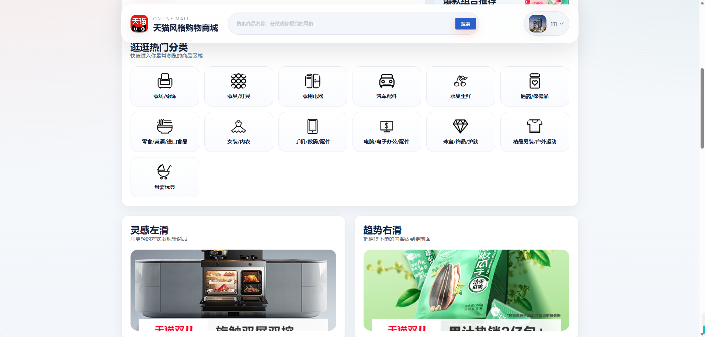

# (仿天猫)Online Shopping Mall

一个基于 `Vue 2 + Element UI + Spring Boot + MyBatis + MySQL` 的在线购物商城项目，包含前台商城与后台管理两部分，适合作为 Java Web / 前后端分离项目练习与毕业设计参考。

## 项目预览

- 前台商城：首页、商品分类、商品详情、搜索、购物车、收藏、地址、订单、个人中心
- 后台管理：管理员、商家、用户、商品、分类、公告、评论、订单等管理功能

## 技术栈

### 前端

- Vue 2.6
- Vue Router 3
- Element UI 2
- Axios
- wangEditor

### 后端

- Spring Boot 2.5.9
- MyBatis
- PageHelper
- MySQL
- JWT
- Hutool

### 运行截图













## 项目结构

```text
Online-shopping-mall-main
├─ springboot                 # 后端 Spring Boot 项目
│  ├─ src/main/java
│  ├─ src/main/resources
│  └─ pom.xml
├─ vue                        # 前端 Vue 项目
│  ├─ src
│  ├─ public
│  └─ package.json
├─ xm_shopping_manager.sql    # 数据库初始化脚本
└─ README.md
```

## 主要功能

### 前台用户端

- 首页商品展示
- 商品分类浏览
- 商品搜索
- 商品详情查看
- 加入购物车
- 商品收藏
- 收货地址管理
- 订单管理
- 个人信息维护

### 后台管理端

- 管理员登录
- 商家管理
- 用户管理
- 商品管理
- 分类管理
- 公告管理
- 评论管理
- 订单管理

## 运行环境

- JDK 1.8
- Maven 3.6+
- Node.js 16+ 或 18+
- MySQL 5.7 / 8.0

## 快速开始

### 1. 克隆项目

```bash
git clone <your-repo-url>
cd Online-shopping-mall-main
```

### 2. 导入数据库

将根目录下的 [xm_shopping_manager.sql](C:\Users\shaowenjie\Desktop\(仿天猫)Online-shopping-mall-main\xm_shopping_manager.sql) 导入到 MySQL 中。

推荐创建数据库：

```sql
CREATE DATABASE xm_shopping_manager DEFAULT CHARACTER SET utf8mb4;
```

然后执行 SQL 脚本导入表结构与初始数据。

### 3. 修改后端数据库配置

编辑 [application.yml](C:\Users\shaowenjie\Desktop\(仿天猫)Online-shopping-mall-main\springboot\src\main\resources\application.yml)，将以下配置改成你本机的数据库信息：

```yml
spring:
  datasource:
    driver-class-name: com.mysql.cj.jdbc.Driver
    username: root
    password: 123456
    url: jdbc:mysql://你的数据库地址:3306/xm_shopping_manager?useUnicode=true&characterEncoding=utf-8&allowMultiQueries=true&useSSL=false&serverTimezone=GMT%2b8&allowPublicKeyRetrieval=true
```

默认后端端口：

```yml
server:
  port: 9090
```

### 4. 启动后端

进入后端目录：

```bash
cd springboot
mvn spring-boot:run
```

或先打包再运行：

```bash
mvn clean package
java -jar target/springboot-0.0.1-SNAPSHOT.jar
```

### 5. 启动前端

打开新的终端，进入前端目录：

```bash
cd vue
npm install
npm run serve
```

前端开发环境默认会读取：

```env
VUE_APP_BASEURL='http://localhost:9090'
```

### 6. 访问项目

- 前台商城：`http://localhost:8080/front`
- 后台管理：`http://localhost:8080/`
- 后端接口：`http://localhost:9090`

## 开发说明

### 前端

- 前端目录在 [vue](C:\Users\shaowenjie\Desktop\(仿天猫)Online-shopping-mall-main\vue)
- 核心页面在 [src/views](C:\Users\shaowenjie\Desktop\(仿天猫)Online-shopping-mall-main\vue\src\views)
- 路由配置在 [src/router/index.js](C:\Users\shaowenjie\Desktop\(仿天猫)Online-shopping-mall-main\vue\src\router\index.js)

### 后端

- 后端目录在 [springboot](C:\Users\shaowenjie\Desktop\(仿天猫)Online-shopping-mall-main\springboot)
- 启动类在 [SpringbootApplication.java](C:\Users\shaowenjie\Desktop\(仿天猫)Online-shopping-mall-main\springboot\src\main\java\com\example\SpringbootApplication.java)
- Controller 位于 `com.example.controller`
- Mapper XML 位于 `src/main/resources/mapper`

## 注意事项

- 项目当前开发环境前端接口地址为 `http://localhost:9090`
- [vue/.env.production](C:\Users\shaowenjie\Desktop\(仿天猫)Online-shopping-mall-main\vue\.env.production) 里的生产接口地址目前是异常值 `http://:9090`，如果要正式部署，请先改成正确的后端地址
- 上传的图片文件会通过后端文件接口访问，请确保后端服务正常启动
- 如果你本地 MySQL 版本较高，导入数据库后请确认字符集与时区配置无误

## 打包部署

### 前端打包

```bash
cd vue
npm run build
```

### 后端打包

```bash
cd springboot
mvn clean package
```

## 适用场景

- Java Web 课程设计
- 毕业设计项目参考
- Vue + Spring Boot 前后端分离练习
- 电商后台管理系统学习

## License

本项目仅用于学习与交流，请勿直接用于商业用途。
